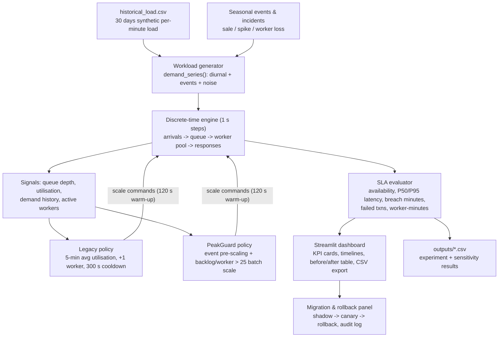

# Architecture

## Component diagram

## Components

| Component | File | Responsibility |
|---|---|---|
| Simulation engine | `simulator.py` | 1-second discrete simulation of arrivals, queue, workers, timeouts, warm-up, failures |
| Policies | `simulator.py` (`legacy_policy`, `peakguard_policy`) | Map signals to scale actions; identical warm-up and fleet cap for fair comparison |
| Scenario library | `simulator.py` (`SCENARIOS`) | normal_day, scheduled_sale, sudden_spike, worker_loss |
| Data generator | `generate_data.py` | Reproducible 30-day synthetic historical load |
| Experiment runner | `run_experiments.py` | Full scenario x policy matrix -> CSV |
| Sensitivity runner | `sensitivity.py` | One-at-a-time assumption sweeps -> CSV |
| Dashboard | `app.py` | Scenario picker, sensitivity sliders, KPI cards, timeline charts, rollback demo |
| Tests | `test_simulator.py` | 6 pytest tests: behaviour, caps, reproducibility, invariants |

## Data flow

1. `demand_series` builds a per-second TPS profile from base load + event multipliers.
2. Each second: arrivals enter the queue; workers process up to capacity; transactions whose
   wait would exceed 1000 ms are counted failed; latency is recorded from carried backlog.
3. Every 30 s the active policy observes signals and may issue a scale command; new workers
   become active only after the warm-up delay.
4. Metrics aggregate to availability, P95 latency, breach minutes, max queue, failures,
   worker-minutes; per-minute traces feed the dashboard charts.

## Deployment

- Local: `streamlit run app.py` (any modest laptop; no GPU, no external services).
- Free tier: Streamlit Community Cloud or Render (single process, no database).
- No secrets, credentials, or network calls required anywhere in the system.
